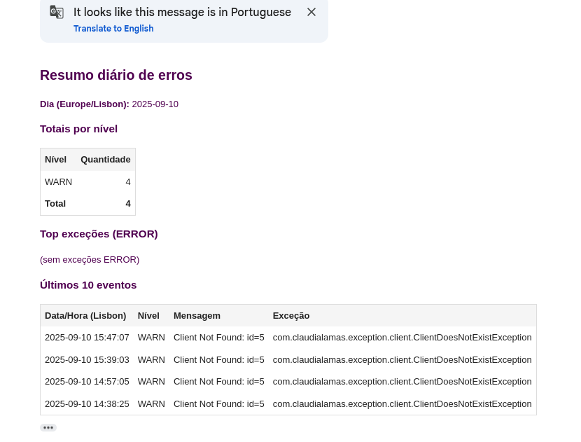

# Order System Backend

  
  
  


## 📌 Description
This project is a **backend system for managing orders and clients**, built with **Java 8**, **Spring Boot**, **Hibernate/JPA**, and **MSSQL Server**.  
The system exposes a **REST API** secured with **OAuth2 (Bearer Token)** and provides:
- Create, list, and retrieve orders.
- Manage clients.
- Validate client data through an external REST service.
- Log errors and send error reports via email.

## 🛠️ Technologies
- **Java 8**
- **Spring Boot**
- **Hibernate/JPA**
- **Maven**
- **MSSQL Server (Docker Compose)**
- **OAuth2 (JWT)**
- **REST API**
- **Email service**

## 📂 Project Structure
- `src/main/java/com/claudialamas/` → Application source code
- `docker/` → Docker Compose configuration (MSSQL Server)
- `scripts/` → SQL scripts for database and tables creation
- `postman/` → Postman Collection

## ▶️ How to Run

### 1. Clone the repository
```bash
git clone <repo-url>
cd order-system-backend
```
### 2. Start the database (MSSQL with Docker)
```bash
cd docker
docker-compose up -d
```
### 3. Create database and tables

Database need to be manually created. Use the script `createDatabase.sql`.

The tables and table schema are automatically created by the backend. However, if necessary to manually create them, use the script 'createTables.sql'.

Both scripts were designed and tested in dBeaver.

```bash

cd ../scripts
# Run the SQL scripts in order:
# 1. createDatabase.sql
# 2. createTables.sql
```
### 4. Configure application.properties
```bash
security.jwt.secret=<YOUR-SECRET-KEY-HS256-32CHARS>
# ====== EMAIL VALIDATION API =====
external.email.api-key=<GENERATE-A-API-KEY-AT-CAPTAINVERIFY.COM>
# ====== EMAIL SENDER ======
spring.mail.username=<YOUR-EMAIL-ADRESS>
spring.mail.password=<EMAIL-APP-PASSWORD>
app.mail.from=<EMAIL-SENDER>
app.errorlog.report.recipient=<RECIPIENT-EMAIL>
```
### 5. Run the application
```bash
mvn spring-boot:run
```
The API will be available at:
```bash
http://localhost:8080
```
## 📖 API Documentation

The API is fully documented and accessible through **Swagger UI** at:  
[http://localhost:8080/swagger-ui.html](http://localhost:8080/swagger-ui.html)


A **Postman collection** with example requests is available in the root folder of the project.  


## Error Reports

The application sends an email, with the error report. This can be trigger by the endpoint `{{baseUrl}}/admin/error-report/today` 
Example of an email report:



 ## Improvements
- Authentication:
  - user and password hard coded, should be a table in the database and the password should be hashed with a SALT. 
- Application.properties
  - should consume sensitive and personal information from environment variables. 
- Application should be containerized and the container instance should provide the environment variables needed by the application.properties. 
- Unit Tests
  - the application should have unit tests, with a coverage that fits the company regulamentations.
  - workflow that enforces the unit tests (eg. GitHub workflow)
    - pull request should run the previous workflow
- Linting tool for Java to enforce code style and standards
- Static code analysis tool (eg. sonarqube)
- CI/CD pipeline to run unit tests, build the backend, containerize it and deploy
- Raise Java version, to take advantage of eventual new functionalities, allowing the usage of more recent packages, and improvements on the code performance.   


